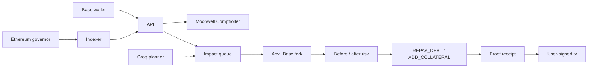

# Fork

[](https://github.com/benjaminnkem/fork/actions/workflows/ci.yml)

**Pre-execution DeFi risk agent.** Fork applies a known protocol change to a pinned Base mainnet fork, reads the wallet from the real Moonwell Comptroller, and only surfaces a rescue the EVM verified.

> The model proposes. The EVM proves.

A position can look healthy at the current block and still be wrecked by a governance action that has already been encoded. Fork answers a narrower question than a portfolio dashboard:

> If this known protocol transition hit this wallet at this block, does the Comptroller still call it solvent — and what bounded action would restore that?

Moonwell Core on Base is **adapter #1**, not the product identity. V1 rescue classes are repay debt and add collateral. The server never holds user keys and never broadcasts mainnet transactions.

Live instance: [fork.oluwadunsin.dev](https://fork.oluwadunsin.dev)

---

## Contents

- [How it works](#how-it-works)
- [What V1 supports](#what-v1-supports)
- [Architecture](#architecture)
- [Pinned replay](#pinned-replay)
- [Quick start](#quick-start)
- [Using the app](#using-the-app)
- [Commands](#commands)
- [Security](#security)
- [Tests](#tests)
- [Documentation](#documentation)
- [Status](#status)

---

## How it works



1. **Snapshot.** Read the wallet’s Moonwell Core markets, collateral flags, and Comptroller `getAccountLiquidity` on Base 8453.
2. **Match.** Index Ethereum MultichainGovernor proposals, decode destination `_setCollateralFactor` calls, and keep only changes that hit a market this wallet supplies as collateral.
3. **Replay.** Fork Base at a pinned block, impersonate the Temporal Governor, apply the exact destination calldata, then read the Comptroller again.
4. **Decide.** Material class comes from those two Comptroller states (`SAFE` / `AT_RISK` / `SHORTFALL`), not from the model.
5. **Search.** If a rescue is in scope, try `REPAY_DEBT` and `ADD_COLLATERAL` on reset Anvil snapshots, then re-apply the change and re-read risk.
6. **Prove.** Hash an economic receipt. Groq may choose tools and explain; it never computes solvency or builds arbitrary calldata.
7. **Act (optional).** Prepare allowlisted calls. The connected wallet signs on Base. The API never `eth_sendRawTransaction`.

Replay grade is `DESTINATION_EFFECT_REPLAY`: impersonate Temporal Governor with verified calldata. It is **not** a full Wormhole VAA replay.

---

## What V1 supports

| In scope                                                               | Out of scope                                              |
| ---------------------------------------------------------------------- | --------------------------------------------------------- |
| Base 8453 Moonwell Core positions                                      | Other lending protocols                                   |
| Ethereum MultichainGovernor after [MIP-X58](docs/PROTOCOL_RESEARCH.md) | Pre-migration Moonbeam governance as source of truth      |
| Collateral-factor changes, starting with proposal **176**              | Caps, oracles, IRMs, listings, other selectors            |
| `REPAY_DEBT` and `ADD_COLLATERAL`                                      | Arbitrary swaps, flash loans, deleverage routers          |
| Groq `openai/gpt-oss-120b` with `openai/gpt-oss-20b` fallback          | LangChain / unrestricted tool access                      |
| User-signed allowlisted Base calls                                     | Server-side sends, autonomous execution                   |
| Real RPC, real Comptroller, real Anvil                                 | Mocked chain data, invented health factors, fake receipts |

`DEFAULT_MIN_SAFETY_BUFFER_BPS` stays empty until a product owner sets it. An unset required buffer fails closed. Receipts record `NO_ADDITIONAL_BUFFER` when no extra buffer is configured.

---

## Architecture

pnpm + Turborepo. TypeScript strict. viem for chain I/O. NestJS API. Next.js App Router UI. MongoDB for durable runs/receipts. Redis + BullMQ for impact jobs. Foundry Anvil for forks.

```text
fork/
├── apps/
│   ├── web/          Next.js 16 dashboard (wagmi, TanStack Query)
│   ├── api/          NestJS /api/v1, SSE, wallet auth, prepare
│   ├── indexer/      Ethereum + Base poll, exposure, enqueue 176
│   └── simulator/    BullMQ worker; owns Anvil process lifecycle
├── packages/
│   ├── protocol-moonwell/   positions, CF decode, replay, plans
│   ├── governance-core/     normalized changes, reorg helpers
│   ├── simulation-core/     Anvil, receipts, idempotency keys
│   ├── risk-engine/         policy + material class
│   ├── strategy-engine/     search/compare wrappers
│   ├── agent-core/          Groq local tool calling
│   ├── blockchain/          viem clients, fail-closed RPC
│   ├── persistence/         Mongo schemas + indexes
│   ├── abis/                registry moonwell-core-2026-08-16
│   └── shared/              domain types and errors
├── replays/moonwell-176.json    identifiers and anchors only
└── docs/                        PRD, spec, security, research
```

Protocol-specific logic stays in `@fork/protocol-moonwell`. The LLM loop stays in `@fork/agent-core`. Deterministic tools live outside the model.

---

## Pinned replay

Public fixture: [`replays/moonwell-176.json`](replays/moonwell-176.json). It stores identifiers and anchors, **not** measured results. `pnpm replay:verify` recomputes from archive RPC + Anvil.

| Field             | Value                                                                                        |
| ----------------- | -------------------------------------------------------------------------------------------- |
| Proposal          | 176                                                                                          |
| Market            | mwrsETH `0xfC41B49d064Ac646015b459C522820DB9472F4B5`                                         |
| Action            | `_setCollateralFactor` 0.68e18 → 0.52e18                                                     |
| Fork              | Base block `48025643` / `0x587e0cab88e0fd0929f24e36240bd4943e8162cab4a42bb1064d48936fa2e8bc` |
| Comptroller       | `0xfBb21d0380beE3312B33c4353c8936a0F13EF26C`                                                 |
| Temporal Governor | `0x8b621804a7637b781e2BbD58e256a591F2dF7d51`                                                 |
| Ethereum governor | `0x8769B70ac7c93AF0e75de0D69877709B66d75838`                                                 |

Demo wallets used in the UI (live Comptroller at head can differ from the fork block):

| Role                     | Address                                                                                                                 |
| ------------------------ | ----------------------------------------------------------------------------------------------------------------------- |
| Shortfall at 176 fork    | [`0x0EFC0653D4Fc2218f27ba9Bb5767C0c83aF25aE6`](https://basescan.org/address/0x0EFC0653D4Fc2218f27ba9Bb5767C0c83aF25aE6) |
| Solvent / add-collateral | [`0x494c7fdb753c15b69fea2293e1b76567ca94462d`](https://basescan.org/address/0x494c7fdb753c15b69fea2293e1b76567ca94462d) |

Launch **Simulate proposal 176** on the shortfall demo to see Comptroller `SAFE → SHORTFALL` at the pinned fork. The risk panel above that button is current head, not the 176 result.

---

## Quick start

### Prerequisites

- Node.js 24 (`.nvmrc`; engines allow `>=20`)
- pnpm 9 (`corepack enable`)
- Docker + Docker Compose (Mongo 7, Redis 7)
- [Foundry](https://book.getfoundry.sh/getting-started/installation) (`anvil`) for replay and impact simulation
- Archive-capable **Base** RPC and an **Ethereum** RPC (Alchemy or QuickNode)
- Groq key (`gsk_…`) only if you run the agent
- A Base 8453 browser wallet only if you test signing

### Install

```bash
pnpm install
cp .env.example .env
```

Minimum `.env`:

```env
BASE_RPC_URL=https://base-mainnet.g.alchemy.com/v2/<key>
ETHEREUM_RPC_URL=https://eth-mainnet.g.alchemy.com/v2/<key>
```

Optional: `GROQ_API_KEY`, `SESSION_SECRET` (`openssl rand -hex 32`). Leave `DEFAULT_MIN_SAFETY_BUFFER_BPS` empty. Keep `ENABLE_AUTONOMOUS_MAINNET_EXECUTION=false`.

```bash
docker compose up -d mongodb redis
pnpm verify:contracts
pnpm governance:sync
pnpm dev
```

| Process   | URL                                |
| --------- | ---------------------------------- |
| Web       | http://localhost:3000              |
| API live  | http://localhost:4000/health/live  |
| API ready | http://localhost:4000/health/ready |

`pnpm governance:sync` writes Ethereum proposals into `.data/governance-store.json` (resolved from the repo root, not `apps/api`). Without it, the UI’s relevant-changes list is empty.

Full variable table: [`docs/ENVIRONMENT.md`](docs/ENVIRONMENT.md). Production start refuses missing `SESSION_SECRET`, `MONGODB_URI`, `REDIS_URL`, and both RPCs.

---

## Using the app

1. Open the web app and paste a Base address, or use **Use shortfall demo** / **Use solvent demo**.
2. Wait for the API to return a real Comptroller snapshot. The UI does not invent dashboard numbers.
3. Connect a wallet only if you need policy writes or transaction preparation. Connecting is not ownership; **Prove ownership** signs a nonce.
4. On a relevant 176 wallet, launch the simulation. Progress streams over SSE (`SIMULATION_QUEUED` → fork → replay → proof).
5. Open the proof receipt. Reproduce it later with `pnpm replay:verify` / `pnpm receipt:reproduce`.
6. Mainnet prepare stays off until `ENABLE_MAINNET_TRANSACTION_PREPARATION=true`. Even then, the user signs in the wallet; the server does not send.

---

## Commands

| Command                                                       | What it does                                              |
| ------------------------------------------------------------- | --------------------------------------------------------- |
| `pnpm dev`                                                    | web + api + indexer + simulator                           |
| `pnpm lint` / `pnpm check-types` / `pnpm test` / `pnpm build` | static suite (CI)                                         |
| `pnpm verify:contracts`                                       | onchain bytecode vs registry `moonwell-core-2026-08-16`   |
| `pnpm chain:smoke`                                            | live Base + Ethereum heads and hash anchors               |
| `pnpm moonwell:wallet <0x…>`                                  | read real Moonwell Core positions and risk                |
| `pnpm governance:sync`                                        | ingest Ethereum proposals, decode Base CF effects         |
| `pnpm fork:replay moonwell-176`                               | Anvil destination-effect replay + receipt                 |
| `pnpm replay:verify`                                          | recompute moonwell-176 from committed anchors             |
| `pnpm fork:strategies moonwell-176 [wallet]`                  | compare `REPAY_DEBT` and `ADD_COLLATERAL`                 |
| `pnpm fork:agent moonwell-176 [wallet]`                       | Groq agent over real tools (`GROQ_API_KEY`)               |
| `pnpm hunt:shortfall`                                         | find real mwrsETH wallets that 176 shortfalls at the fork |
| `pnpm --filter api start`                                     | Nest API via `tsx`                                        |
| `pnpm --filter simulator start`                               | BullMQ worker; owns Anvil                                 |
| `pnpm --filter indexer start`                                 | governance monitor loop                                   |
| `pnpm test:e2e`                                               | Playwright; set `RUN_WEB_E2E=1` for live UI → Anvil       |

`pnpm fork:strategies moonwell-176 <wallet>` treats the last hex argument as the wallet, not a scenario name. `--force-search-buffer` exercises search using the measured post-change buffer + 1; it does not invent a product default.

---

## Security

Non-negotiable rules (see [`docs/SECURITY_AND_THREAT_MODEL.md`](docs/SECURITY_AND_THREAT_MODEL.md)):

- No mocked Base / Ethereum / Moonwell / governance data in product paths.
- No fabricated transaction hashes, payloads, positions, or simulation results.
- No JavaScript floating point for token accounting (`bigint` / decimal strings).
- No LLM solvency math when contracts can answer.
- No unrestricted shell, RPC, DB, HTTP, or transaction tools on the production agent.
- No user private keys or seed phrases on the server.
- Unknown critical protocol semantics fail closed.

Mainnet user actions require client-side wallet signing. `ENABLE_AUTONOMOUS_MAINNET_EXECUTION` cannot be turned on in production.

---

## Tests

CI (`ci.yml`) on `master` / `main` and pull requests: lint, typecheck, unit tests, build. Node 24.

Live gates are opt-in so CI stays deterministic:

| Flag            | What                           |
| --------------- | ------------------------------ |
| `RUN_WEB_E2E=1` | Playwright through API + Anvil |
| `RUN_API_E2E=1` | Nest + BullMQ impact job       |
| `RUN_AGENT=1`   | Groq planner over real tools   |
| `RUN_INDEXER=1` | live indexer tick              |

Last recorded live release gate: [`docs/RELEASE_GATE.md`](docs/RELEASE_GATE.md).

---

## Documentation

| Doc                                                                      | Use it for                                           |
| ------------------------------------------------------------------------ | ---------------------------------------------------- |
| [`docs/HANDOFF.md`](docs/HANDOFF.md)                                     | env by app, deploy order, signing, what not to touch |
| [`docs/PRD.md`](docs/PRD.md)                                             | product definition and acceptance                    |
| [`docs/TECHNICAL_SPECIFICATION.md`](docs/TECHNICAL_SPECIFICATION.md)     | architecture, APIs, queues, adapters                 |
| [`docs/SECURITY_AND_THREAT_MODEL.md`](docs/SECURITY_AND_THREAT_MODEL.md) | trust boundaries                                     |
| [`docs/ENVIRONMENT.md`](docs/ENVIRONMENT.md)                             | every env var                                        |
| [`docs/RUNBOOK.md`](docs/RUNBOOK.md)                                     | local operations                                     |
| [`docs/PROTOCOL_RESEARCH.md`](docs/PROTOCOL_RESEARCH.md)                 | Moonwell / MIP-X58 primary sources                   |
| [`docs/CONTRACT_REGISTRY.md`](docs/CONTRACT_REGISTRY.md)                 | addresses, ABI provenance                            |
| [`docs/KNOWN_LIMITATIONS.md`](docs/KNOWN_LIMITATIONS.md)                 | honesty list                                         |
| [`docs/RELEASE_GATE.md`](docs/RELEASE_GATE.md)                           | last live timings and receipt hash                   |
| [`docs/IMPLEMENTATION_STATUS.md`](docs/IMPLEMENTATION_STATUS.md)         | phase status                                         |
| [`AGENTS.md`](AGENTS.md)                                                 | rules for coding agents                              |

---

## Status

Phase 15 handoff. Moonwell Core adapter, proposal-176 destination-effect replay, queued impact simulations, wallet auth, user-signed prepare, and indexer monitoring are implemented.

Still off by design: email/Telegram, other change classes, full Wormhole replay, a product safety-buffer default, and any server-side mainnet send.
